# [Java-Annotation](https://www.imooc.com/learn/456)

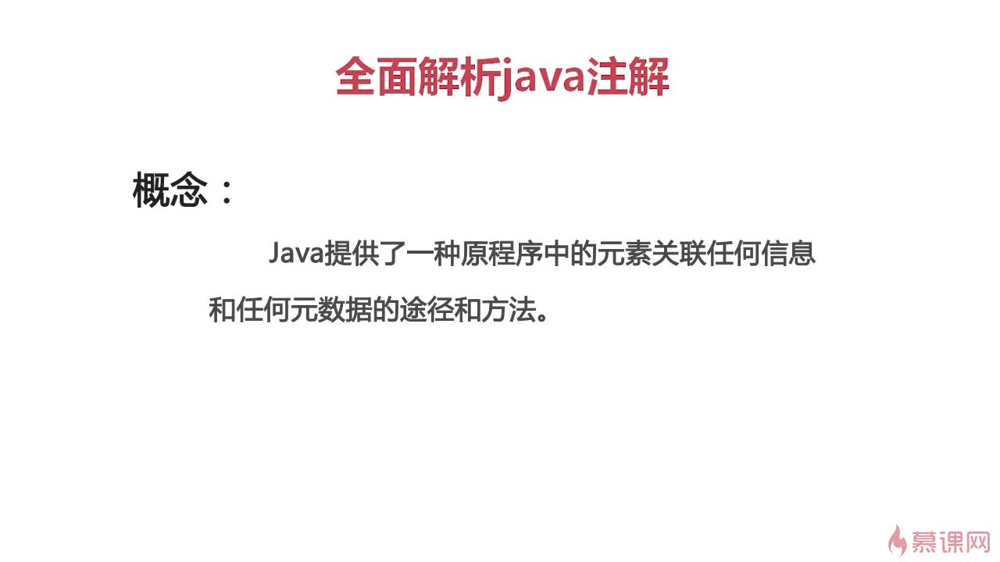

- Java 中的常见注解
- 注解分类
- 自定义注解
- 注解应用实战

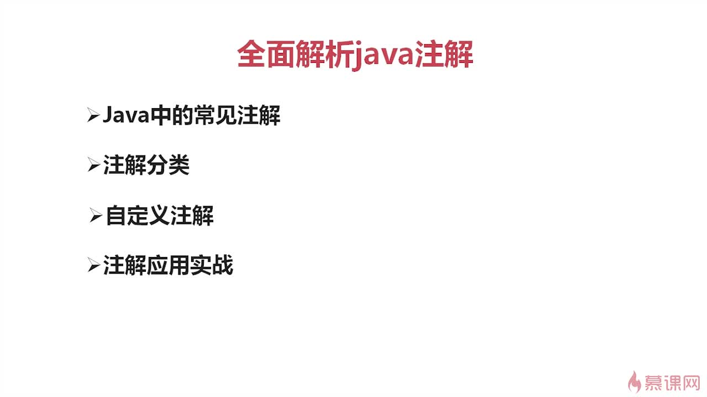

## 1. JDK 中的注解

- `@Override`
- `@Deprecated`
- `@SuppressWarnings("deprecation")`

## 2. 第三方注解

Spring

- `@Autowired`
- `@Service`
- `@Repository`

MyBatis

- `@InsertProvider`
- `@UpdateProvider`
- `@Options`

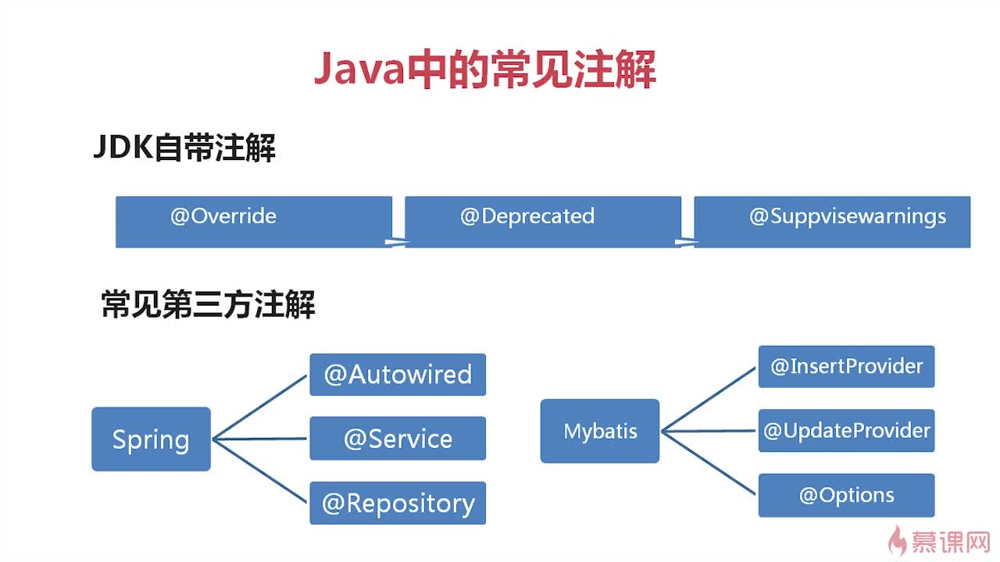

## 3. 注解的分类

- 源码注解：注解只在源码中存在，编译成 `*.class` 文件就不存在了
- 编译时注解：注解在源码和 `*.class` 文件中都存在
- 运行时注解：在运行阶段还起作用，甚至会影响运行逻辑的注解

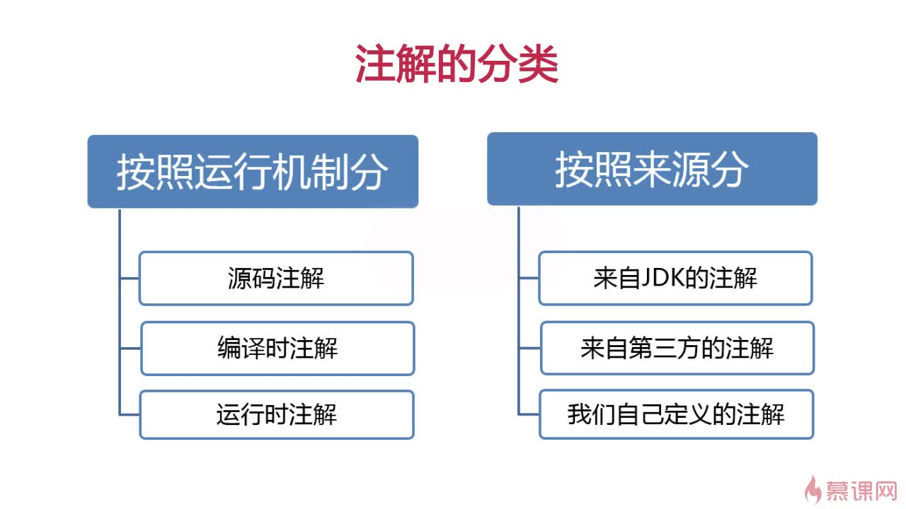

## 4. 自定义注解

### 4.1. 定义注解

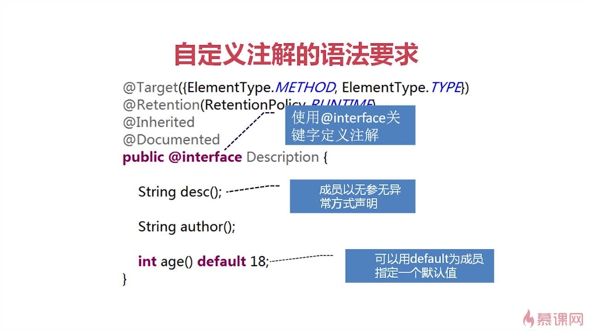

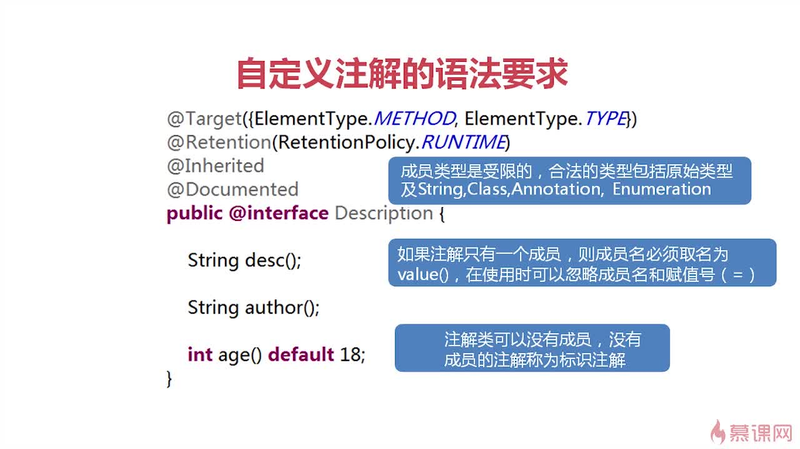

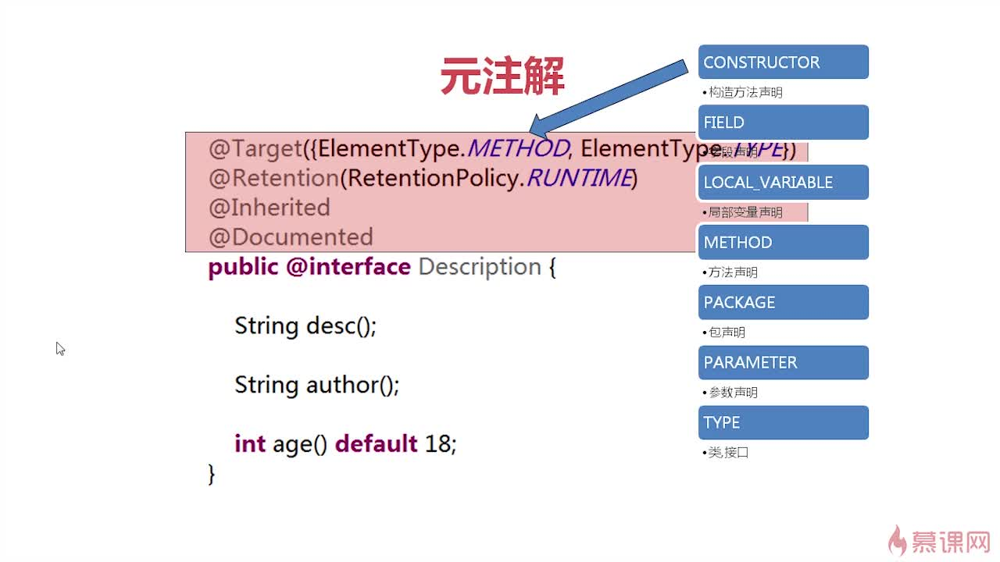

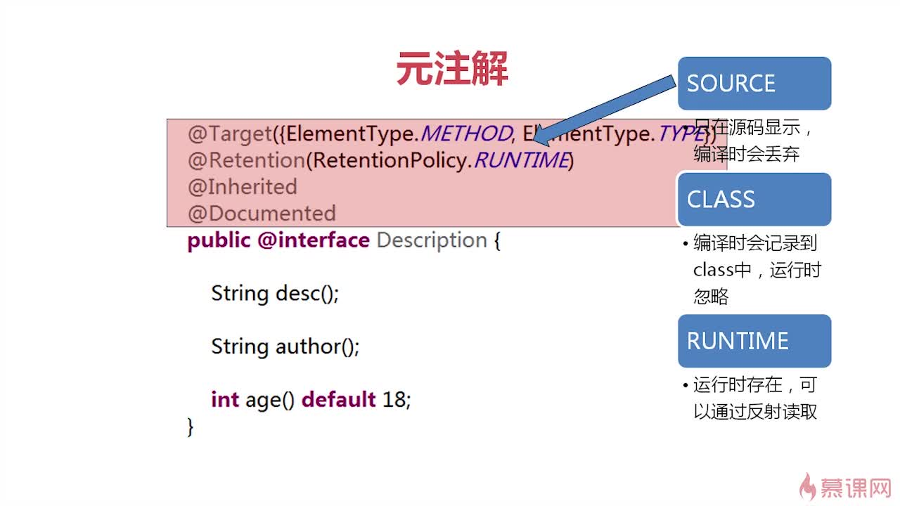

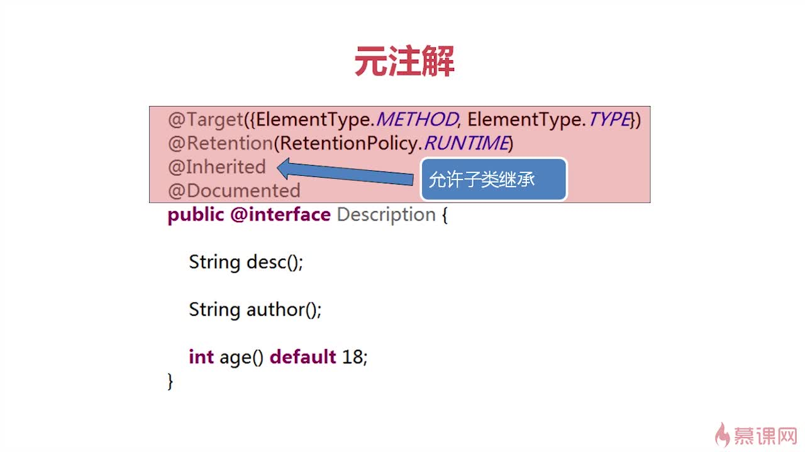

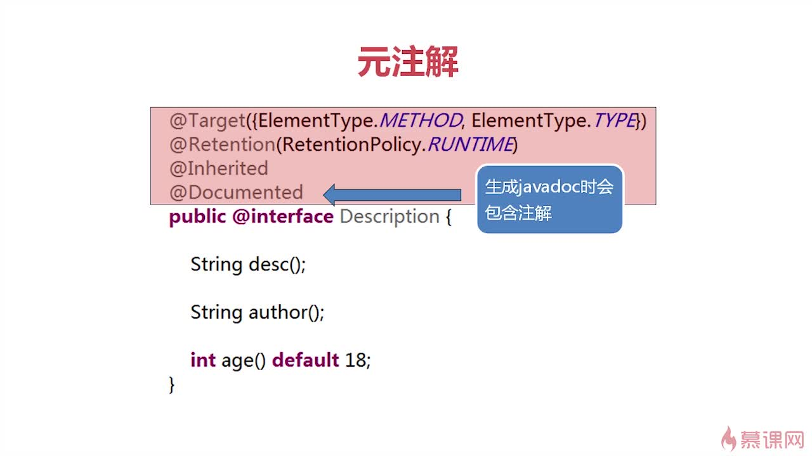

### 4.2. 使用注解

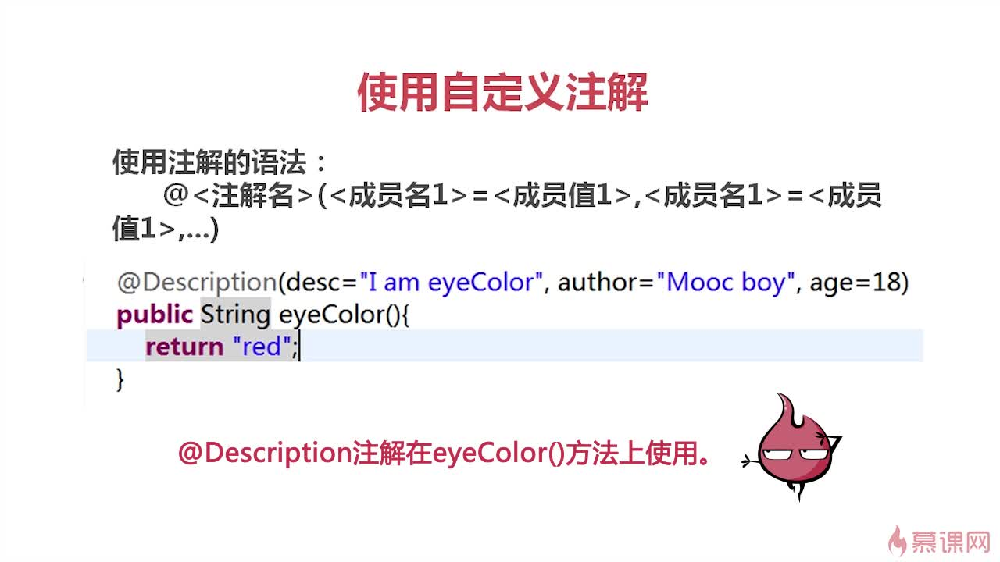

```java
@Target({ElementType.METHOD, ElementType.TYPE})
@Retention(RetentionPolicy.RUNTIME)
@Inherited
@Documented
public @interface Description {
    String desc();
    String author();
    int age() default 18;
}
```

```java
@Target({ElementType.METHOD})
@Retention(RetentionPolicy.RUNTIME)
@Inherited
@Documented
public @interface Description2 {
    String value();
}
```

```java
@Description(desc = "TestClass description", author = "lifei")
public class TestClass {
    @Description(desc = "test1 description", author = "lifei")
    public void test1() {
        System.out.println("test1");
    }
    @Description2("test2 description")
    public void test2() {
        System.out.println("test2");
    }
}
```

### 4.3. 解析注解

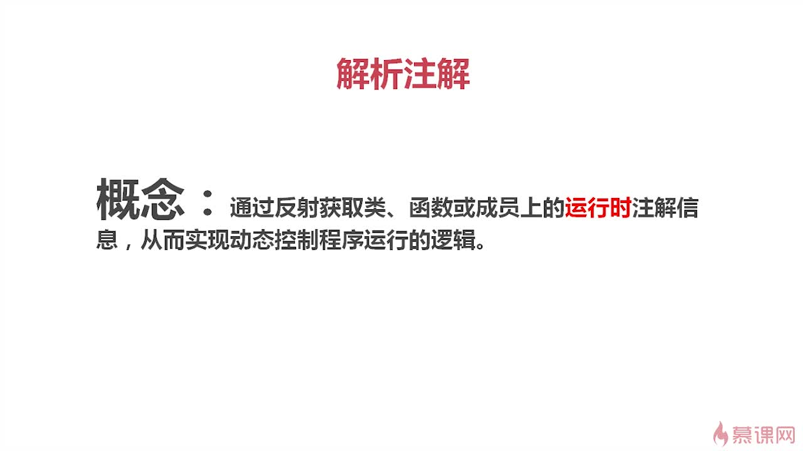

```java
@Target({ElementType.METHOD, ElementType.TYPE})
@Retention(RetentionPolicy.RUNTIME)
@Inherited
@Documented
public @interface Description3 {
    String value();
}
```

```java
@Description3("interface Human")
public interface Human {
    @Description3("interface method name")
    String name();
    int age();
    @Deprecated
    void sing();
}
```

```java
@Description3("class Person")
public class Person implements Human {
    @Override
    @Description3("class method name")
    public String name() {
        return "person";
    }
    @Override
    public int age() {
        return 0;
    }
    @Override
    public void sing() {
        System.out.println("person sing");
    }
}
```

```java
public class Child extends Person {
    @Override
    public String name() {
        return "child";
    }
    @Override
    public int age() {
        return 0;
    }
    @Override
    public void sing() {
        System.out.println("child sing");
    }
}
```

- 不继承接口的注解
- 只继承父类的类注解，不继承父类的方法注解

#### 4.3.1. 解析类注解

```java
public void parseClassAnnotation() throws ClassNotFoundException {
    Class clazz = Class.forName("org.example.java_annotation.parse2.Child");
    boolean isExist = clazz.isAnnotationPresent(Description3.class);
    if (isExist) {
        Description3 d = (Description3) clazz.getAnnotation(Description3.class);
        System.out.println(d.value());
    }
}
```

#### 4.3.2. 解析方法注解

```java
public void parseMethodAnnotation() throws ClassNotFoundException {
    Class clazz = Class.forName("org.example.java_annotation.parse2.Child");
    Method[] methods = clazz.getMethods();
    for (Method method : methods) {
        if (method.isAnnotationPresent(Description3.class)) {
            Description3 d = method.getAnnotation(Description3.class);
            System.out.println(d.value());
        }
    }
}
```

```java
public void parseMethodAnnotation2() throws ClassNotFoundException {
    Class clazz = Class.forName("org.example.java_annotation.parse2.Child");
    Method[] methods = clazz.getMethods();
    for (Method method : methods) {
        Annotation[] annotations = method.getAnnotations();
        for (Annotation a : annotations) {
            if (a instanceof Description3) {
                Description3 d = method.getAnnotation(Description3.class);
                System.out.println(d.value());
            }
        }
    }
}
```

## 5. 注解实战

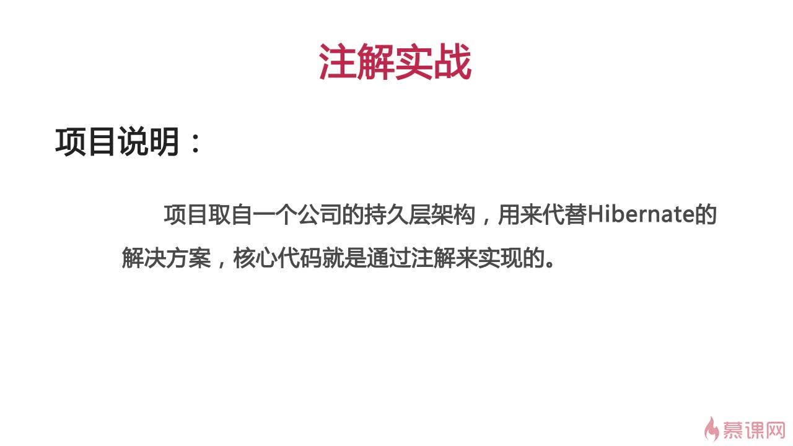

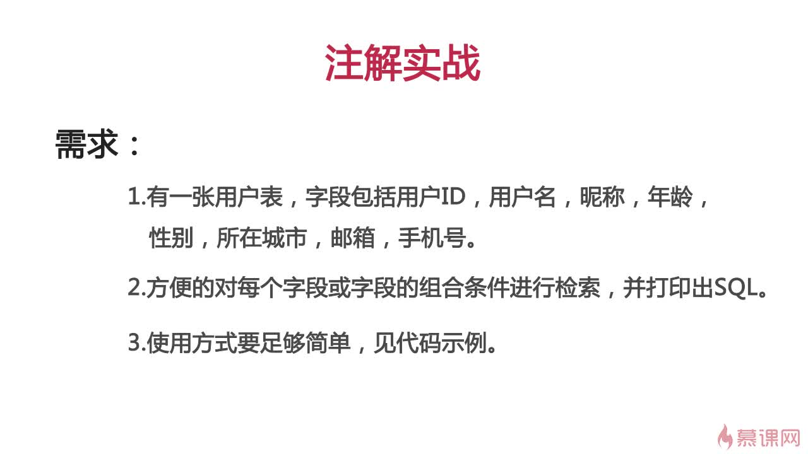

### 5.1. 定义注解

```java
@Target({ElementType.TYPE})
@Retention(RetentionPolicy.RUNTIME)
public @interface Table {
    String value();
}
```

```java
@Target({ElementType.FIELD})
@Retention(RetentionPolicy.RUNTIME)
public @interface Column {
    String value();
}
```

### 5.2. 类间关系

```java
public abstract class Filter {
}
```

```java
@Table("user")
public class Filter1 extends Filter {
    @Column("id")
    private int id;
    @Column("username")
    private String username;
    @Column("nickname")
    private String nickname;
    @Column("age")
    private int age;
    @Column("city")
    private String city;
    @Column("email")
    private String email;
    @Column("mobile")
    private String mobile;
    // ...
}
```

### 5.3. 工具类

```java
public class FilterUtil {
    public String query(Filter f) {
        StringBuilder sb = new StringBuilder();
        // ...
        return sb.toString();
    }
}
```

```java
// 获取表名
Class clazz = f.getClass();
boolean classExist = clazz.isAnnotationPresent(Table.class);
if (!classExist) {
    return null;
}
Table table = (Table) clazz.getAnnotation(Table.class);
String tableName = table.value();
sb.append("select * from ").append(tableName).append(" where 1=1 ");
```

```java
// 依次获取字段名
Field[] fields = clazz.getDeclaredFields();
for (Field field : fields) {
    boolean fieldExist = field.isAnnotationPresent(Column.class);
    if (!fieldExist) {
        return null;
    }
    Column column = field.getAnnotation(Column.class);
    String columnName = column.value();
    String fieldName = field.getName();
    String fieldGetMethodName = "get" + fieldName.substring(0, 1).toUpperCase()
            + fieldName.substring(1);
    Object fieldValue = null;
    try {
        Method method = clazz.getMethod(fieldGetMethodName);
        fieldValue = method.invoke(f);
    } catch (NoSuchMethodException | IllegalAccessException |
            InvocationTargetException e) {
        e.printStackTrace();
    }
    // sb.append(" and ").append(columnName).append("=").append(fieldValue);
}
```

```java
// 处理null和integer=0的情况
boolean fieldValueEqualsZero = fieldValue instanceof Integer && (int) fieldValue == 0;
if (fieldValue == null || fieldValueEqualsZero) {
    continue;
}
```

```java
// 处理字符串的情况
if (fieldValue instanceof String) {
    // 处理多个值同时匹配
    if (((String) fieldValue).contains(",")) {
        String[] values = ((String) fieldValue).split(",");
        sb.append(" and (1=0 ");
        for (String v : values) {
            sb.append(" or ").append(columnName).append("='").append(v).append("'");
        }
        sb.append(") ");
    } else {
        sb.append(" and ").append(columnName).append("='").append(fieldValue).append("'");
    }
} else {
    sb.append(" and ").append(columnName).append("=").append(fieldValue);
}
```

### 5.4. 测试

```java
Filter1 f1 = new Filter1();
f1.setId(10);
Filter1 f2 = new Filter1();
f2.setUsername("lucy,andy,tom");
f2.setAge(18);
Filter1 f3 = new Filter1();
f3.setEmail("liu@sina.com,zh@163.com,77777@qq.com");
FilterUtil filterUtil = new FilterUtil();
String sql1 = filterUtil.query(f1);
String sql2 = filterUtil.query(f2);
String sql3 = filterUtil.query(f3);
System.out.println(sql1);
System.out.println(sql2);
System.out.println(sql3);
```

```sql
select * from user where 1=1  and id=10
select * from user where 1=1  and (1=0  or username='lucy' or username='andy' or username='tom')  and age=18
select * from user where 1=1  and (1=0  or email='liu@sina.com' or email='zh@163.com' or email='77777@qq.com')
```

### 5.5. 重用

```java
@Table("department")
public class Filter2 extends Filter {
    @Column("id")
    private int id;
    @Column("name")
    private String name;
    @Column("leader")
    private String leader;
    @Column("amount")
    private int amount;
}
```

```java
Filter2 filter2 = new Filter2();
filter2.setAmount(10);
filter2.setName("技术部");
System.out.println(filterUtil.query(filter2));
```

```sql
select * from department where 1=1  and name='技术部' and amount=10
```
